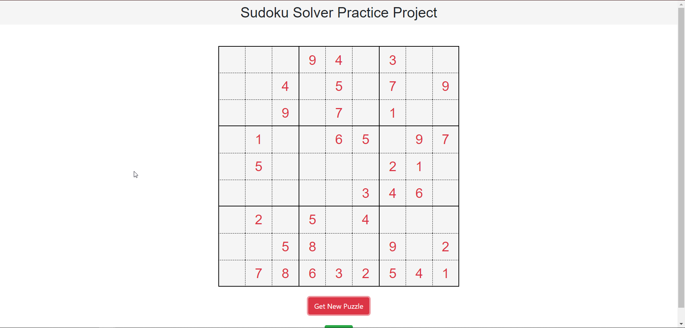
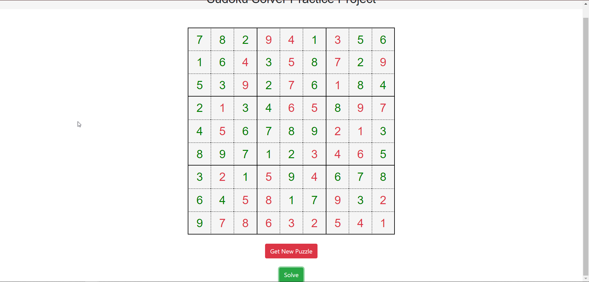

# sudoku-project-1
A dynamic website displaying the SUDOKU SOLVER GAME using HTML, CSS and Javascript.
The project is implemented using the well-known backtracking algorithm. It allows users to generate a 9x9 unsolved Sudoku grid using ‘Get New Puzzle’ button and then get the solved version of it using the ‘Solve’ button.

## Working
On pressing the 'Get New Puzzle' button, it fetches a new unsolved 9x9 sudoku board from an external source everytime.

On pressing the 'Solve' button, it solves the board on backend using the BACKTRACKING algorithm and then displays the result.

